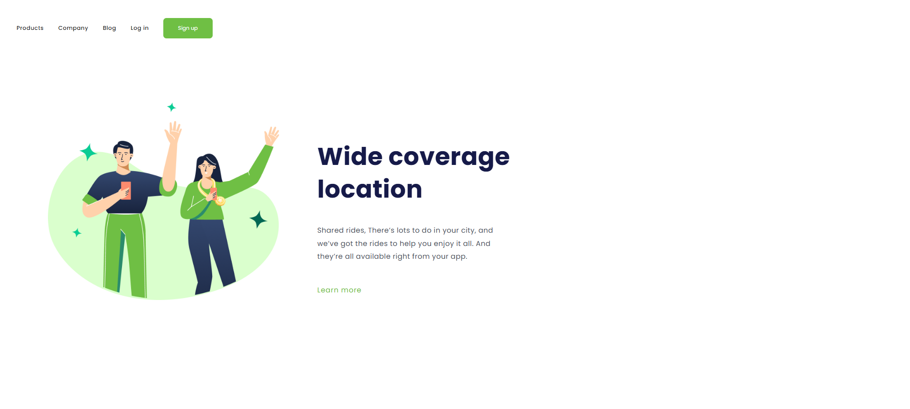

# Wide coverage location

Este projeto é uma landing page responsiva criada para promover um serviço de compartilhamento de viagens ou um serviço com ampla cobertura geográfica.

## Funcionalidades

* Design responsivo que se adapta a diferentes tamanhos de tela.
* Cabeçalho com links de navegação e um botão de "Sign up".
* Seção principal com um título chamativo, uma descrição do serviço e um link "Learn more".
* Imagem ilustrativa de um casal.

## Como Usar

Para visualizar a página, basta abrir o arquivo `index.html` em um navegador web.

## Instalação

Como este é um projeto HTML/CSS estático, não há necessidade de instalação. Basta clonar o repositório ou baixar os arquivos e abrir o `index.html` em seu navegador.

## Estrutura de arquivos
* `index.html`: Arquivo HTML principal da página.
* `styles.css`: Arquivo CSS com os estilos da página.
* `img/img-casal.png`: Imagem do casal.

## Imagem da tela

## Contribuição

Se você deseja contribuir com este projeto, siga estas etapas:

1.  Faça um fork do repositório.
2.  Crie uma branch com a sua feature (`git checkout -b feature/sua-feature`).
3.  Faça commit das suas alterações (`git commit -am 'Add some feature'`).
4.  Faça push para a branch (`git push origin feature/sua-feature`).
5.  Abra um Pull Request.

## Contato

Se você tiver alguma dúvida ou sugestão, entre em contato comigo.
